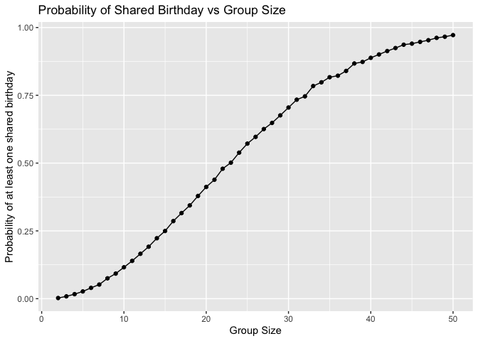
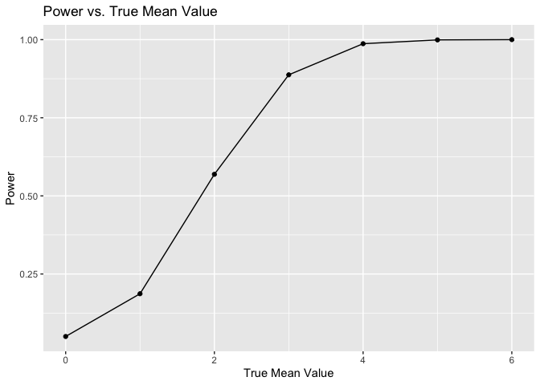
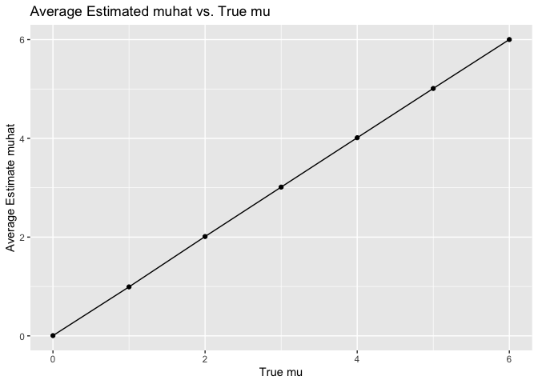
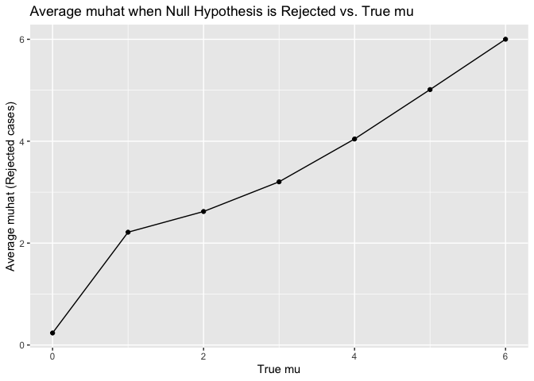
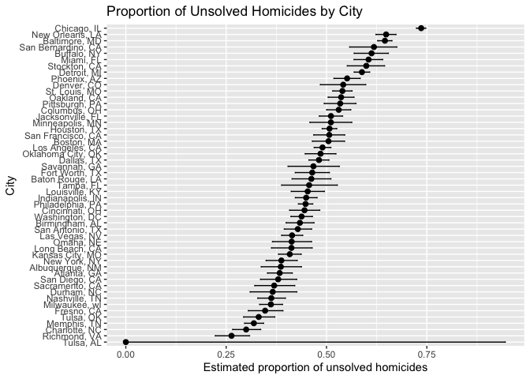

p8105_hw5_nrl2142
================
2025-11-14

``` r
library(tidyverse)
```

    ## ── Attaching core tidyverse packages ──────────────────────── tidyverse 2.0.0 ──
    ## ✔ dplyr     1.1.4     ✔ readr     2.1.5
    ## ✔ forcats   1.0.0     ✔ stringr   1.5.1
    ## ✔ ggplot2   4.0.0     ✔ tibble    3.3.0
    ## ✔ lubridate 1.9.4     ✔ tidyr     1.3.1
    ## ✔ purrr     1.1.0     
    ## ── Conflicts ────────────────────────────────────────── tidyverse_conflicts() ──
    ## ✖ dplyr::filter() masks stats::filter()
    ## ✖ dplyr::lag()    masks stats::lag()
    ## ℹ Use the conflicted package (<http://conflicted.r-lib.org/>) to force all conflicts to become errors

``` r
library(rvest)
```

    ## 
    ## Attaching package: 'rvest'
    ## 
    ## The following object is masked from 'package:readr':
    ## 
    ##     guess_encoding

``` r
library(broom)
set.seed(1)
```

# Problem 1

``` r
shared_birthday = function(n){
  birthdays = sample(1:365, n, replace = TRUE)
  any(duplicated(birthdays))
}

groupsize = 2:50

probabilities = tibble(
  groupsize = groupsize) |>
  mutate(
    probability = map_dbl(groupsize, ~ mean(replicate(10000, shared_birthday(.x)))
  ))

ggplot(probabilities, aes(x=groupsize, y = probability)) + 
  geom_line() +
  geom_point() +
  labs(title = "Probability of Shared Birthday vs Group Size",
       x = "Group Size",
       y = "Probability of at least one shared birthday")
```

<!-- -->

# Problem 2

``` r
n=30
sigma=5
muvalues = 0:6
numberofsims = 5000

results = expand_grid(mu=muvalues, replicate = 1:numberofsims) |>
  mutate(
    mutrue = rep(muvalues, each =numberofsims),
    muhat = NA_real_,
    pvalue = NA_real_,
    rejectnull = NA
  )

for (i in 1:nrow(results)) {
  mu = results$mutrue [i]
  x = rnorm (n, mean = mu, sd = sigma)
  test = t.test(x, mu =0)
  tidiedtest = broom::tidy(test)
  results$muhat [i] = tidiedtest$estimate
  results$pvalue [i] = tidiedtest$p.value
  results$rejectnull [i] = tidiedtest$p.value<0.05
}

powerstats = results |>
  group_by(mutrue) |>
  summarize(power=mean(rejectnull))

ggplot(powerstats, aes(x=mutrue, y = power)) +
  geom_line()+
  geom_point()+
  labs(title = "Power vs. True Effect Size",
       x = "True Effect Size",
       y = "Power")
```

<!-- -->

From the plot, power appears to increase as true effect size increases.

``` r
averagemuhat = results |>
  group_by(mutrue) |>
  summarize(meanmuhat = mean(muhat))

plot1 = ggplot(averagemuhat, aes(x=mutrue, y=meanmuhat)) +
  geom_point() +
  geom_line() +
  labs (title = "Average Estimated muhat vs. True mu",
        x = "True mu",
        y = "Average Estimate muhat")

averagemuhat_nullrejected = results |>
  filter(rejectnull) |>
  group_by (mutrue) |>
  summarize (meanmuhat_nullrejected = mean(muhat))

plot2 = ggplot(averagemuhat_nullrejected, aes(x=mutrue, y=meanmuhat_nullrejected)) +
  geom_point() +
  geom_line()+
  labs(title= "Average muhat when Null Hypothesis is Rejected vs. True mu",
       x = "True mu",
       y = "Average muhat (Rejected cases)")

plot1 
```

<!-- -->

``` r
plot2
```

<!-- -->

When 0 \< true mu \< 3, the sample average of muhat across tests for
which is the null is rejected is NOT approximately equal to the true
value of mu. However, when true mu \> 3, the sample average of muhat
across tests for which the null is rejected is approximately equal to
the true value of mu. This occurs because of selection bias. When 0
\<true mu \< 3, the chance of detecting a real effect and rejecting the
null is low, leading rejected samples to be biased towards
overestimation of muhat. However, when true my \>3, the test has enough
power to the reject the null more frequently and thus we are more likely
to produce muhat estimated close to the truemu.

# Problem 3

The raw homicide data has 52179 observations of criminal homicides over
the past decade in 50 of the largest American cities. The raw dataset
has 12 variables: `uid`, `reported_date` (reported date of the
homicide), `victim_last` (victim’s last name), `victim_first` (victim’s
first name), `victim_race` (victim’s race), `victim_age` (victim’s age),
`victim_sex` (victim’s sex), `city` (city where the homicide occurred),
`state` (state where the homicide occurred), `lat` (latitude), `lon`
(longitude), `disposition` (status of the homicide case).

``` r
murder_df = read_csv(file = "homicide-data.csv") |>
  janitor::clean_names() |>
  mutate (city_state = stringr::str_c(city, state, sep = ", "))
```

    ## Rows: 52179 Columns: 12
    ## ── Column specification ────────────────────────────────────────────────────────
    ## Delimiter: ","
    ## chr (9): uid, victim_last, victim_first, victim_race, victim_age, victim_sex...
    ## dbl (3): reported_date, lat, lon
    ## 
    ## ℹ Use `spec()` to retrieve the full column specification for this data.
    ## ℹ Specify the column types or set `show_col_types = FALSE` to quiet this message.

``` r
city_df = murder_df |>
  group_by (city_state) |>
  summarise(
    total_homicides = n(),
    unsolved = sum(disposition %in% c("Closed without arrest", "Open/No arrest"))
  )

baltimore_df = city_df |>
  filter(city_state == "Baltimore, MD")

baltimore_proptest = prop.test(
  x = baltimore_df$unsolved,
  n = baltimore_df$total_homicides
)

baltimorebroomtidy = broom::tidy (baltimore_proptest) |>
  select (estimate, conf.low, conf.high)

estimatedbaltimore_proptest = baltimorebroomtidy$estimate
lowerci_baltimore = baltimorebroomtidy$conf.low
upperci_baltimore = baltimorebroomtidy$conf.high

cities_ci = city_df |>
  mutate(
    testresult = map2(
      unsolved, 
      total_homicides,
      ~ prop.test (x=.x, n=.y)
    ),
    tidiedresult = map(testresult, broom::tidy)
  ) |>
  unnest(tidiedresult) |>
  select (city_state, estimate, conf.low, conf.high)
```

    ## Warning: There was 1 warning in `mutate()`.
    ## ℹ In argument: `testresult = map2(unsolved, total_homicides, ~prop.test(x = .x,
    ##   n = .y))`.
    ## Caused by warning in `prop.test()`:
    ## ! Chi-squared approximation may be incorrect

``` r
ggplot(cities_ci, aes(x=reorder(city_state, estimate))) +
  geom_point(aes(y=estimate), size =2)+
  geom_errorbar(aes(ymin = conf.low, ymax =conf.high), width = 0.2) + 
  coord_flip() +
  labs(title = "Proportion of Unsolved Homicides by City",
       x = "City",
       y = "Estimated proportion of unsolved homicides")
```

<!-- -->
